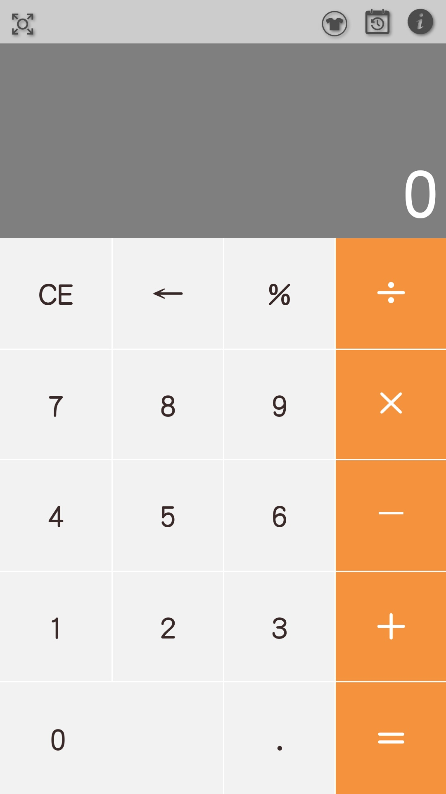
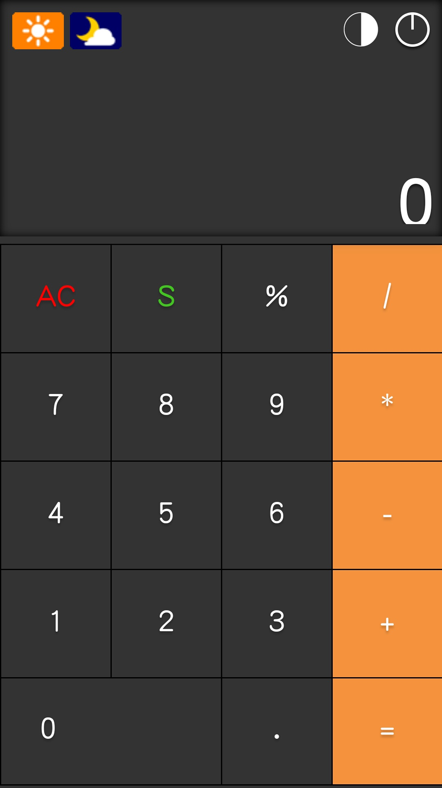
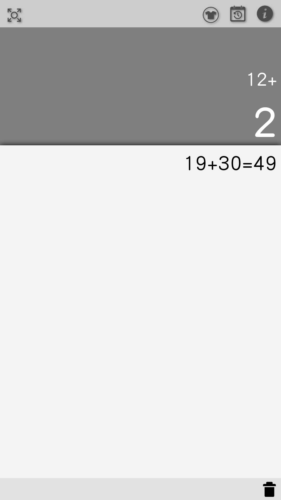
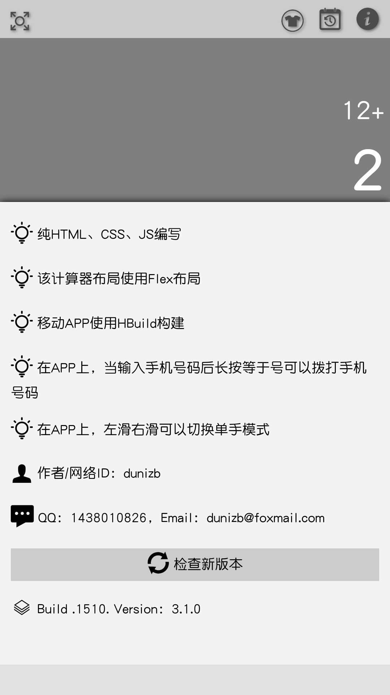
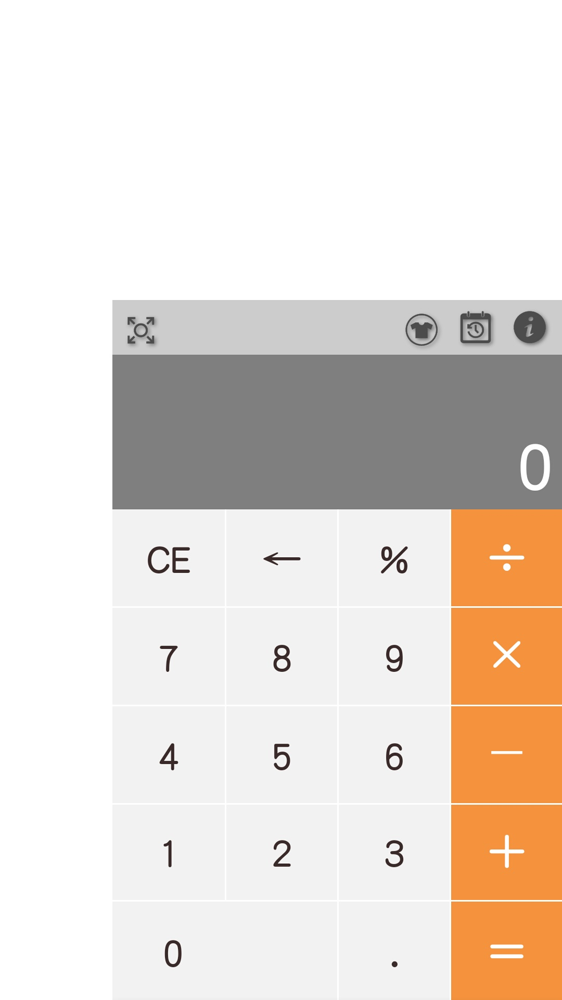

# sCalc

## 功能说明
A simple calculator,一个简易计算器

1. 纯HTML、CSS、JS编写
2. 该计算器布局使用CSS3 FlexBox布局
3. 移动APP使用HBuild构建
4. 在APP上，当输入手机号码后长按等于号可以拨打手机号码
5. 左滑右滑可以切换单手模式
6. 内置两套主题可切换

作者/网络ID：Dunizb，博客：http://dunizb.com

※Build 20160812224616.1510 Version：3.1.0

介绍文章：[纯HTML+CSS+JavaScript编写的计算器应用](http://www.imooc.com/article/13009)

## 版本
+ [网页版](http://duni.sinaapp.com/demo/demos/%E7%AE%80%E6%98%93%E7%BD%91%E9%A1%B5%E8%AE%A1%E7%AE%97%E5%99%A8/)
+ 手机网页版请扫码下面二维码（左）
+ [下载安卓APP（v3.1.0）](http://dunizb.b0.upaiyun.com/demo/app/myCalc-3.1.0.apk) 扫码下面二维码（右）

## 效果图
| 主页1-灰白主题 | 主页2-黑暗主题 | 单手模式（左） |
|-------------|-------------|-------------|
|  |  |  |

| 历史记录页面 | 关于页面 | 单手模式（右） |
|-------------|-------------|---------------|
|  |  |  |

## TODO

- [ ] 重构
- [ ] 浮点数计算精度丢失问题

## 更新记录
[update.md](UPDATE.md)
